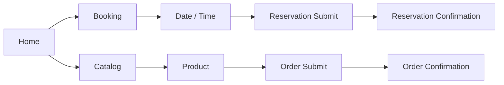

# Flow Diagram

```mermaid
flowchart LR
    H["Home"] --> B["Booking"]
    B --> DT["Date / Time"]
    DT --> R["Reservation Submit"]
    R --> RC["Reservation Confirmation"]

    H --> C["Catalog"]
    C --> P["Product"]
    P --> O["Order Submit"]
    O --> OC["Order Confirmation"]
```
